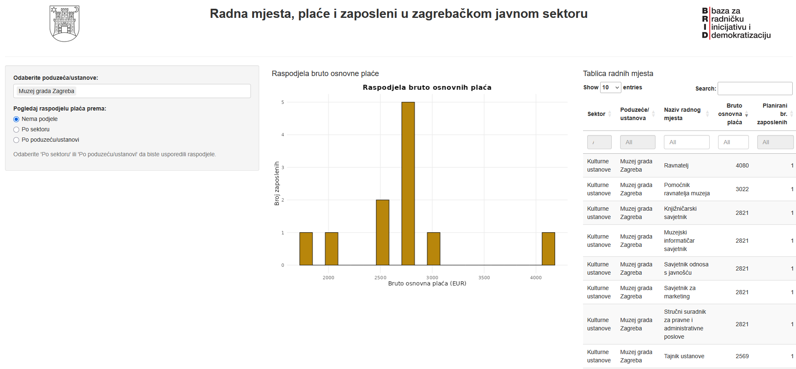

# Sistematizacije, zaposleni i radni uvjeti u poduzećima i ustanovama Grada Zagreba (BRID)

Članovi Baze za radničku inicijativu i demokratizaciju (BRID)
napravili su analizu jaza između planiranog i stvarnog broja izvršitelja
na radnim mjestima u poduzećima i ustanovama Grada Zagreba iz područja
zdravstva i kulture. Istraživači su putem platforme
[Imamo pravo znati](https://imamopravoznati.org/) zatražili podatke o
planiranom i stvarnom broju izvršitelja po radnim mjestima,
plaćama i članovima sindikata. Jedan od ishoda njihovog projekta je
[web aplikacija](https://marko-lucic.shinyapps.io/grad_zagreb_otvoreni_podaci/)
u kojoj možete pregledavati plaće i sistematizaciju radnih mjesta
za ustanove i poduzeća koja su sudjelovala u istraživanju.

